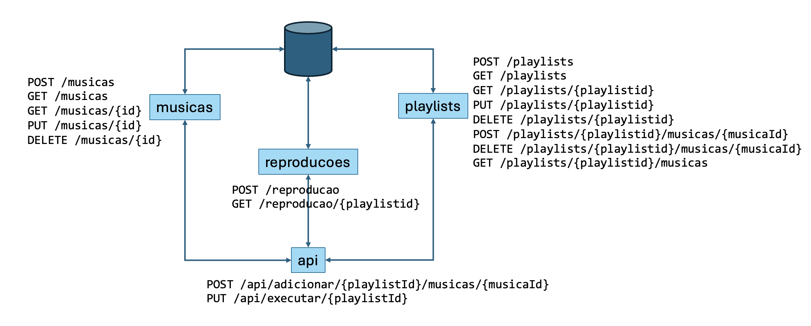

## MS-AV-01-Endpoints

- A **Play Your List** deseja lançar um app para montagem de *playlists* para execução de músicas com foco em empresas que desejem implantar o sistema HPWM (*High Productivity With Music*).
- Basicamente, a solução será composta por 4 miscroserviços:
    - **musicas**: mantém as músicas disponíveis (CRUD)
    - **playlists**: responsável pela manutenção das *playlists*
    - **reproducoes**: controla quantas vezes a *playlist* foi executada
    - **api**: orquestra os serviços
- Apesar que o ideal seria criar um projeto para cada microserviço, para facilicar, criar todos os `endpoints` dentro do mesmo projeto
- Forma de entrega: link para repositório **git**

### Scripts de Banco de Dados
- Os *scripts* abaixo podem ser criados dentro do mesmo arquivo `data.sql`
- Armazenamento das músicas:
```sql
DROP TABLE IF EXISTS musicas;

CREATE TABLE musicas (
    id INT GENERATED BY DEFAULT AS IDENTITY PRIMARY KEY,
    titulo VARCHAR(150) NOT NULL,
    artista VARCHAR(150) NOT NULL,
    album VARCHAR(150),
    duracao INTEGER NOT NULL,
    genero VARCHAR(50)
);

INSERT INTO musicas (titulo, artista, album, duracao, genero)
VALUES ('Imagine', 'John Lennon', 'Imagine', 183, 'Rock');

INSERT INTO musicas (titulo, artista, album, duracao, genero)
VALUES ('Billie Jean', 'Michael Jackson', 'Thriller', 294, 'Pop');

INSERT INTO musicas (titulo, artista, album, duracao, genero)
VALUES ('Bohemian Rhapsody', 'Queen', 'A Night at the Opera', 354, 'Rock');

INSERT INTO musicas (titulo, artista, album, duracao, genero)
VALUES ('Garota de Ipanema', 'Tom Jobim', 'Getz/Gilberto', 328, 'Bossa Nova');

INSERT INTO musicas (titulo, artista, album, duracao, genero)
VALUES ('Tempo Perdido', 'Legião Urbana', 'Dois', 301, 'Rock');
```
- Controle da *playlist*
```sql

DROP TABLE IF EXISTS playlists;
DROP TABLE IF EXISTS playlist_musicas;

CREATE TABLE playlists (
    id INT GENERATED BY DEFAULT AS IDENTITY PRIMARY KEY,
    nome VARCHAR(100) NOT NULL,
    descricao VARCHAR(255));

CREATE TABLE playlist_musicas (
    id INT GENERATED BY DEFAULT AS IDENTITY PRIMARY KEY,
    playlistid INT NOT NULL,
    musicaid INT NOT NULL,
    FOREIGN KEY (playlistid) REFERENCES playlists(id),
    FOREIGN KEY (musicaid) REFERENCES musicas(id));

INSERT INTO playlists (nome, descricao)
VALUES ('Clássicos do Rock', 'Grandes clássicos do rock internacional');

INSERT INTO playlists (nome, descricao)
VALUES ('Música Brasileira', 'Clássicos da música brasileira');

INSERT INTO playlists (nome, descricao)
VALUES ('Pop Internacional', 'Sucessos do pop internacional');

INSERT INTO playlists (nome, descricao)
VALUES ('Para Relaxar', 'Músicas para momentos tranquilos');

INSERT INTO playlists (nome, descricao)
VALUES ('Favoritas', 'Minha seleção pessoal de músicas favoritas');

INSERT INTO playlist_musicas (playlistid, musicaid) VALUES (1, 1);
INSERT INTO playlist_musicas (playlistid, musicaid) VALUES (1, 3);
INSERT INTO playlist_musicas (playlistid, musicaid) VALUES (1, 5);
INSERT INTO playlist_musicas (playlistid, musicaid) VALUES (2, 4);
INSERT INTO playlist_musicas (playlistid, musicaid) VALUES (3, 2);
INSERT INTO playlist_musicas (playlistid, musicaid) VALUES (4, 1);
INSERT INTO playlist_musicas (playlistid, musicaid) VALUES (4, 4);
INSERT INTO playlist_musicas (playlistid, musicaid) VALUES (5, 1);
INSERT INTO playlist_musicas (playlistid, musicaid) VALUES (5, 2);
INSERT INTO playlist_musicas (playlistid, musicaid) VALUES (5, 5);
```
- Estatísticas de reprodução da *playlist*
```sql
DROP TABLE IF EXISTS reproducoes;

CREATE TABLE reproducoes (
    id INT GENERATED BY DEFAULT AS IDENTITY PRIMARY KEY,
    playlistid INT NOT NULL,
    datahora TIMESTAMP NOT NULL
);

INSERT INTO reproducoes (playlistid, datahora) VALUES (1, CURRENT_TIMESTAMP);
INSERT INTO reproducoes (playlistid, datahora) VALUES (1, CURRENT_TIMESTAMP);
INSERT INTO reproducoes (playlistid, datahora) VALUES (1, CURRENT_TIMESTAMP);
INSERT INTO reproducoes (playlistid, datahora) VALUES (1, CURRENT_TIMESTAMP);
INSERT INTO reproducoes (playlistid, datahora) VALUES (1, CURRENT_TIMESTAMP);
INSERT INTO reproducoes (playlistid, datahora) VALUES (2, CURRENT_TIMESTAMP);
INSERT INTO reproducoes (playlistid, datahora) VALUES (2, CURRENT_TIMESTAMP);
INSERT INTO reproducoes (playlistid, datahora) VALUES (2, CURRENT_TIMESTAMP);
INSERT INTO reproducoes (playlistid, datahora) VALUES (3, CURRENT_TIMESTAMP);
INSERT INTO reproducoes (playlistid, datahora) VALUES (3, CURRENT_TIMESTAMP);
INSERT INTO reproducoes (playlistid, datahora) VALUES (4, CURRENT_TIMESTAMP);
INSERT INTO reproducoes (playlistid, datahora) VALUES (5, CURRENT_TIMESTAMP);

```
- Obs: para o campo `datahora` pode-se utilizar em *java* o `LocalDateTime` (`LocalDateTime dataHora = LocalDateTime.now();`)
### Endpoints

- Abaixo estão as especificações de *endpoints* a serem criados:
- **musicas**: mantém as músicas disponíveis (CRUD)
    - `POST /musicas`: Cadastrar uma nova música
    - `GET /musicas`: Listar todas as músicas
    - `GET /musicas/{id}`: Buscar uma música pelo ID
    - `PUT /musicas/{id}`: Atualizar uma música
    - `DELETE /musicas/{id}`: Excluir uma música
- Exemplo para testar a criação / alteração
```json
{
  "titulo": "Hotel California",
  "artista": "Eagles",
  "album": "Hotel California",
  "duracao": 391,
  "genero": "Rock"
}
``` 
- **playlists**: responsável pela manutenção das *playlists*
    - `POST /playlists`: Criar uma nova playlist
    - `GET /playlists`: Listar todas as playlists
    - `GET /playlists/{playlistid}`: Buscar uma playlist pelo playlistid
    - `PUT /playlists/{playlistid}`: Atualizar o nome e descrição de uma *playlist*
    - `DELETE /playlists/{playlistid}`: Excluir uma *playlist* e suas músicas associadas
    - `POST /playlists/{playlistid}/musicas/{musicaId}`: Adicionar uma música à *playlist*
    - `DELETE /playlists/{playlistid}/musicas/{musicaId}`: Remover uma música da *playlist*
    - `GET /playlists/{playlistid}/musicas`: Listar as músicas de uma *playlist* (pode retornar apenas os `ids` das músicas **SEM** o nome, descrição, etc...)

- **reproducao**: controla quantas vezes a *playlist* foi executada
    - `POST /reproducao`: Cria um registro de reprodução da *playlist* no banco de dados
    - `GET /reproducao/{playlistid}`: Listar todas as reproduções de uma *playlist*
    - `GET /reproducao/total/{playlistid}`: Retornar o total de vezes que uma *playlist* foi executada

- **api**: orquestra os serviços
    - `POST	/api/adicionar/{playlistId}/musicas/{musicaId}`: Adicionar uma música a uma playlist, validando os dois recursos via **Open Feign**. Deve existir uma validação para somente incluir uma música existente (com o `musicaId`) dentro de uma *playlist* já criada (validar o `playlistId`). Caso a validação seja bem sucedida, retornar a mensagem *Música (nome da musica) adicionada com sucesso à playlist (nome da playlist)*.
    - `PUT	/api/executar/{playlistId}`: Executa uma *playlist* gerando um registro de sua execução pelo *endpoint* `POST /statistic` (usar **Open Feign**)

### Regras de Validação
- Ao cadastrar ou atualizar uma música, devem ser aplicadas as seguintes validações:
    - Título: obrigatório e não pode ser vazio ou conter apenas espaços
    - Artista: obrigatório e não pode ser vazio ou conter apenas espaços
    - Álbum: opcional, mas, quando informado, deve ter no máximo 150 caracteres
    - Duração: obrigatória e deve ser maior que zero
    - Gênero: opcional, mas, quando informado, deve ter no máximo 50 caracteres

- Ao cadastrar ou atualizar uma *playlist**, devem ser aplicadas as seguintes validações:
    - Nome: obrigatório e não pode ser vazio ou conter apenas espaços
    - Descrição: opcional, mas, quando informada, deve ter no máximo 255 caracteres